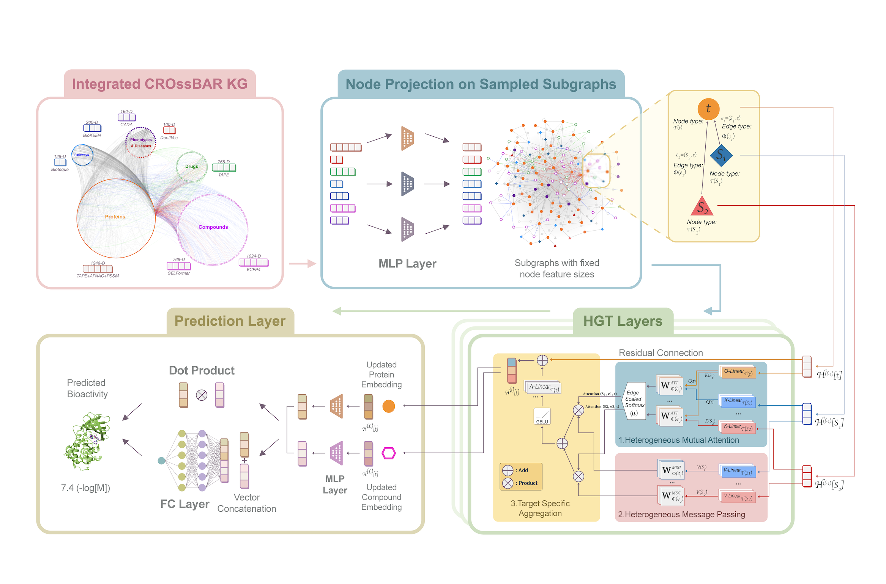

# ECLIPSE
**Exploration of Complex Ligand-Protein Interactions through Learning from Systems-level Heterogeneous Biomedical Knowledge Graphs**

ECLIPSE is an AI-powered framework for predicting compound–protein interactions. By combining advanced graph modeling, comprehensive biomedical knowledge, and pre-trained embeddings, it uncovers hidden relationships within complex biological networks, offering a practical tool for researchers in drug discovery and computational biology.

**ECLIPSE combines:**
- **Large-scale heterogeneous biomedical knowledge graphs (KGs):** We built this integrated KG using our in-house [CROssBAR platform](https://crossbar.kansil.org/about.php), capturing entities, including genes, proteins, drugs, compounds, pathways, diseases, and phenotypes, and their multi-layered interactions.  
- **Feature embeddings from language and graph models:** Each biological entity is represented using learned embeddings, enabling richer context and better predictions.  
- **Heterogeneous Graph Transformer (HGT):** Unlike standard GNNs, HGT leverages node and edge types with type-specific attention, effectively modeling complex and diverse relationships.

  

**The schematic representation of the ECLIPSE framework.** ECLIPSE is a systems-level framework for predicting compound–protein bioactivity. **The Integrated CROssBAR KG module** provides a multi-relational biomedical graph of proteins, compounds, drugs, pathways, phenotypes, and diseases, serving as the structural foundation for representation learning. From this graph, sampled subgraphs are processed in the **Node Projection on Sampled Subgraphs module**, where type-specific MLP layers project heterogeneous input node features into fixed-size representations. These embeddings are then passed into stacked **HGT Layers**, which apply heterogeneous mutual attention, message passing, and target-specific aggregation with residual connections to generate contextualized node embeddings. Finally, the **Prediction Layer** combines updated compound and protein embeddings, which are first refined through separate MLPs, either through vector concatenation with a fully connected network or via dot product, to predict bioactivity values.

